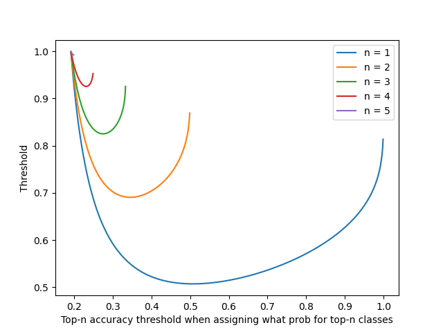

# The Nature Conservancy Fisheries Monitoring

https://www.kaggle.com/c/the-nature-conservancy-fisheries-monitoring/overview

Code is modified from the Pytorch version code of [CAL](https://github.com/raoyongming/cal).

## Prepare the data

Participate in the Kaggle competition to download
the [data](https://www.kaggle.com/c/the-nature-conservancy-fisheries-monitoring/data). Uncompressed data folder
to `./the-nature-conservancy-fisheries-monitoring`. The data structure should be:

  ```
  ./the-nature-conservancy-fisheries-monitoring
          └─── train/
                  └─── ALB/
                  └─── BET/
                  └─── DOL/
                  └─── LAG/
                  └─── NoF/
                  └─── OTHER/
                  └─── SHARK/
                  └─── YFT/
          └─── test
                  └─── test_stg2/
                          └─── image_00001.jpg
                          └─── ...
                  └─── img_00005.jpg (test_stg1)
                  └─── ...
  ```

And then run `python3 prepare.py`.

## Requirements

- Python 3
- PyTorch 1.0+
- [Apex](https://github.com/NVIDIA/apex)

## Train

- Make directories `./save`, `./pred`
- Modify `config_distributed.py` to run experiments on different datasets
- Run `bash train_distributed.sh --fold` to train models.
    - fold = 1/2/3/4: use fold-1/2/3/4 (4-fold in total)
    - fold = other number: use 0.1 validation size
    - You can run `./run_4_fold.sh` to train 4 folds.
- Train/valid/test transforms can be modified in `utils.py` (function `get_transform`)

## Infer validation set and visualize the attention maps of validation data

- Set configurations in ```config_infer.py``` and run  `python3 infer.py` to conduct multi-crop evaluation.
- The probabilities to calculate "log loss" in inferring are pre-processed by top-3-probability-adjustment rule.
    - top-3-probability-adjustment rule: the 3 classes with the highest prob are assigned 0.25, other 5 classes are
      assigned 0.05

## Make testing prediction file

- Set configurations in ```config_infer.py``` and run  `python3 test.py` to make a prediction file.
- After a run of test.py, 3 files will be produced:
  1. original probabilities
  2. probabilities after processed by top-3-probability-adjustment rule
  3. probabilities after processed by top-1-probability-adjustment rule
  - top-3-probability-adjustment rule: the 3 classes with the highest prob are assigned 0.25, other 5 classes are assigned 0.05
  - top-1-probability-adjustment rule: the 1 classes with the highest prob are assigned 0.507, other 5 classes are assigned 0.07242857142

## Ensemble different prediction files

- Modify `aggregate.py`. Set what csv_files to vote. Set the way you want to set weights. Set the method you want to assign probabilities manually. 
- Run `python3 aggregate.py`
- Because this competition evaluates your submission by calculating log-loss. It's suggested to modify the probability prediction to avoid getting many penalties by some bad cases.

## InceptionV3

- If you want to train the InceptionV3 (Keras), please refer to `inceptionV3/`.

## Other tools

### Mosaic augmentation
If you want to run mosaic augmentation, you can use `mosaic-aug/mosaic-aug.py`.

### Visualize top-n-probability-adjustment-rule

You can run `top-n-prob-adjustment-analysis.py` to know how to tune for top-n-prob-adjustment better.
- Top-n-prob-adjustment rule:
  ```text
  Assume k classes in total,
  give top-n-prob classes a prob "a"; assign other classes "(1-a*n)/(k-n)".
  
  For example: 
  Let n=3, k=8, a=0.25  
  If we get a prediction: [0.12, 0.43, 0.05, 0.20, 0.07, 0.01, 0.02, 0.03]
  We will manually make a new prediction: 
                          [0.25, 0.25, 0.05, 0.25, 0.05, 0.05, 0.05, 0.05]
  The top-3 classes will be 0.25; others will be 0.05.
  
  When n = 3, to pass the baseline 1.65163,
  if we set a=0.275, the top-3-accuracy threshold will be lowest;
  that is, if we can ensure our top-3-accuracy > 0.825050 and set a=0.275, then we'll pass the baseline 1.65163.
  ```
  ```text
  When n = 1, min thresh 0.507381 occurs when a = 0.507000
  When n = 2, min thresh 0.690625 occurs when a = 0.345000
  When n = 3, min thresh 0.825050 occurs when a = 0.275000
  When n = 4, min thresh 0.925423 occurs when a = 0.231000
  When n = 5, min thresh 0.992130 occurs when a = 0.198000
  ```
  

## Reference

- Counterfactual Attention Learning (CAL)
    - [Code](https://www.kaggle.com/c/the-nature-conservancy-fisheries-monitoring/data)
    - [Paper](https://arxiv.org/abs/2108.08728)
- Weakly Supervised Data Augmentation Network (WS-DAN)
    - [Code](https://github.com/GuYuc/WS-DAN.PyTorch)
    - [Paper](https://arxiv.org/abs/1901.09891v2)
- CoAtNet code are modified on https://github.com/chinhsuanwu/coatnet-pytorch (MIT license)  

